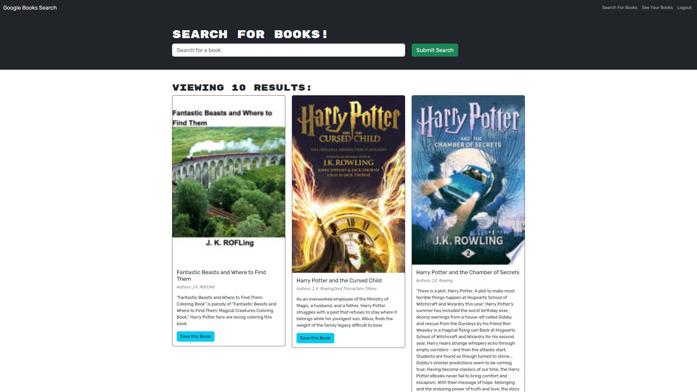

# book-search-engine

## Description

An online web application that uses the Google Books API search engine to browse for books and bookmark them into your collection.

## Table of Contents

- [Installation](#installation)
- [Usage](#usage)
- [Screenshot](#screenshot)
- [Resources](#resources)
- [License](#license)

## Installation

This application can be run through the browser using the provided link down below. Alternatively, the application can be run locally using the following instrctions:

1. Download or clone this repository
2. [node.js](https://nodejs.org/en) is required for this application
3. `npm i` in the terminal to install the required npm packages
4. `npm run develop` to invoke the application
5. Use the following link to run the application: http://localhost:3000/

## Usage

Acess the application using the following deployed [LINK](https://google-api-book-search-engine-4b6582bc310c.herokuapp.com/).

## Screenshot

This is the general setup of the application.

## Resources

- Special thanks to [Xandromus](https://github.com/Xandromus) for providing the [Starter Code](https://github.com/coding-boot-camp/solid-broccoli.git).
- Special thanks to the team at AskBCS for assisting in this project.
- Special thanks to the class instructor for assisting in this project.

## License

Please refer to the LICENSE in the repo.

---
